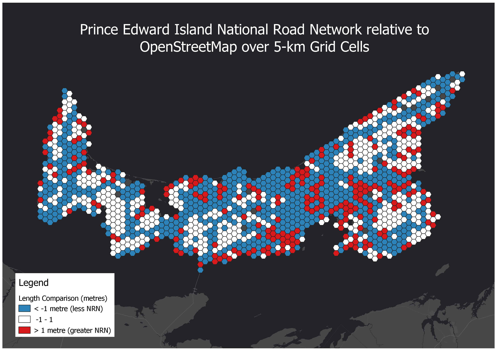

# compare_length_osm.py

This Python script takes OpenStreetMap (OSM) and NRN road layers as inputs and compared length over grid cells between the two datasets.

1. Download provincial NRN data from [gcgeo.gc.ca](http://gcgeo.gc.ca) or [Open Maps](https://open.canada.ca/en/open-maps).

```shell
$ cd data/raw
$ wget https://geoprod.statcan.gc.ca/nrn_rrn/pe/NRN_RRN_PE_18_0_GPKG.zip
$ unzip NRN_RRN_PE_18_0_GPKG.zip
```

2. Download OSM data from [Geofabrik](http://download.geofabrik.de/north-america/canada.html). For easily digestible OSM data, download the `.shp.zip` data from the "quick links". OSM data is also provided in a variety of formats such as `.osm.pbf` and `.osm.bz2`.

```shell
$ cd data/raw
$ wget http://download.geofabrik.de/north-america/canada/prince-edward-island-latest-free.shp.zip
$ unzip http://download.geofabrik.de/north-america/canada/prince-edward-island-latest-free.shp.zip
```

3. Execute ```compare_length_osm.py```.

```shell
$ python compare_length_osm.py "/PATH/TO/OSM/*.shp" "/PATH/TO/INPUT/*.GPKG" "INPUT_LAYER" "/PATH/TO/OUTPUT/*.GPKG" "OUTPUT_LAYER"
```

Example:

```shell
$ python compare_length_osm.py ../data/raw/prince-edward-island-latest-free.shp/gis_osm_roads_free_1.shp ../data/raw/NRN_PE_18_0.gpkg NRN_PE_18_0_ROADSEG LEN
```

## Result
*(data as of February 2020)*

