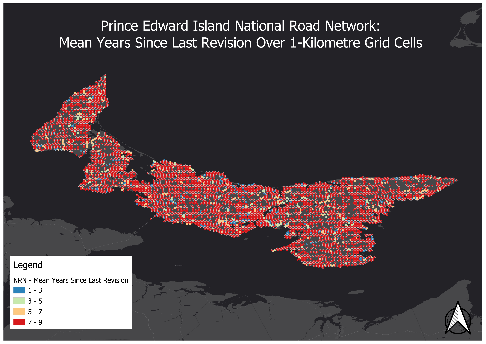

# since_revision.py

This Python script takes an input GeoPackage from the NRN (ROADSEG layer) and calculates the years since last revision for each road segment feature across grid cells.

1. Download provincial NRN data from [gcgeo.gc.ca](http://gcgeo.gc.ca) or [Open Maps](https://open.canada.ca/en/open-maps).

```shell
$ cd data/raw
$ wget https://geoprod.statcan.gc.ca/nrn_rrn/pe/NRN_RRN_PE_18_0_GPKG.zip
$ unzip NRN_RRN_PE_18_0_GPKG.zip
```

2. Execute ```since_revision.py```.

```shell
$ cd src
$ python since_revision.py "PATH/TO/INPUT/*.GPKG" "PATH/TO/OUTPUT/*.GPKG" "INPUT_LAYER" "OUTPUT_LAYER"
```

Example:

```shell
$ python since_revision.py ../data/raw/NRN_PE_18_0.gpkg ../data/processed/PEI.gpkg NRN_PE_18_0_ROADSEG SINREV
```

## Result
*(data as of November 2019)*

